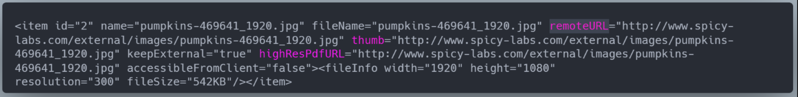

# Publisher & DAM Integration Guide

## Introduction

Welcome to the refreshed guide on how to integrate your Digital Asset Management (DAM) system with CHILI publisher. This guide is crafted to help developers navigate methods of integration, providing a blend of high-level overviews and detailed explanations as needed. We're assuming you're somewhat familiar with the GraFx Publisher APIs.

This guide is best suited for those who have a basic understanding of CHILI integrations, such as loading templates from the BackOffice, saving these templates, and exporting them as PDF files. If you're new to this process, you might find the guide a bit complex or too abstract.

Please note that this guide is in its second draft stage, so while it may lack in polish, it's filled with valuable insights on real-world integrations that you might not find elsewhere.

## Key Terms and Definitions

- **CHILI**: Refers to CHILI publish. This term may also encompass CHILI publisher, CHILI API, or CHILI Editor.
- **Editor**: The editing tool that operates within an iframe.
- **Itengration**: A working title for the new integration interface with CHILI, covering all external applications and interfaces.
- **Asset**: An image referenced by CHILI in a document.
- **ApiCallName**: Refers to CHILI API calls, identified by their method name. CHILI's API documentation, which follows a REST-like structure adapted from SOAP, can be accessed at `https://{environmentName}.chili-publish.online/swagger/ui/index`.

## Overview

When incorporating CHILI publisher into a DAM system, it typically introduces a new section for managing "Templates" as opposed to traditional "Assets" like PNG or PDF files. These templates enable users to select, personalize, and enrich designs with assets and information from the DAM, leveraging CHILI publisher's features to transform designs into smart artworks effectively.

## User Authentication

For our Integration, each user needs two API keys:
- **End User Key**: For opening documents in the Editor, with minimal permissions.
- **Server User Key**: For server requests, with extensive permissions.

API keys are generated via `GenerateApiKey` or `GenerateApiKeyWithSettings`. If access to external assets requires header authentication (Basic Auth, Cookie, custom headers), an API key must be created for each Integration user or user group.

**GenerateApiKeyWithSettings**

GenerateApiKeyWithSettings saves you some API calls. The body of the request looks like: 

```json
{
  "userName": "username",
  "password": "password",
  "settingsXML": "<settings><item name='noAutomaticPreviewForNewItems' value='true'/></settings>" 
}
```

For the settings, each item is optional, and the key names are sensitive. An exception will be thrown for invalid key names. 

Below is possible key names for our settings

  - allowWorkspaceAdministration 
  - allowContentAdministration  
  - noAutomaticPreviewForNewItems 
  - userLanguage 
  - userLanguageIgnoreWorkSpaceLanguage 
  - xinetUser 
  - xinetPW 
  - userAssetDirectory 
  - userGroupAssetDirectory 
  - documentAssetDirectory 

The only one we care about currently is “noAutomaticPreviewForNewItems” a setting that turns off preview generation. By default, CHILI will generate previews automatically, which has been known to cause race conditions. For your Integration it should not be too big of a concern, but safer to turn it off by setting it to "true". 

### Storing API Keys
If external asset authentication via a header was not a requirement, then one workflow is to generate one API key for “end user” and one for “server user” which would be reused over and over again for each Integration user that logs into the system.

However, if external asset authentication via a header is required, then API keys will need to be generated and then have that header set via an API call. Thus you cannot easily re-use API keys for different Integration users due to those users having different permissions.

You can set custom headers using the following API calls:

  - ApiKeySetRequestHeaderForDomain for front end 
  - ApiKeySetHeaderFieldForServerDownloads for output

These headers will be called on API requests from the Editor for external assets.

Using these API calls can be found in these videos, but really these videos are the same: setting the header.

  - [ExternalAssetsCookies.mp4](./videos/ExternalAssetsCookies.mp4) 
  - [ExternalAssetsBasicAuthorization.mp4](./videos/ExternalAssetsBasicAuthorization.mp4)

### API Key Life Span

API keys live for 10 hours (this is number could change in the future), and you can find their validTill date when generated. This value is based on the time of the server. You can get the server date using the GetServerDate. 

API keys can be extended using ApiKeyKeepAlive - I don’t know the technical details of how far back the valid date gets extended. What I know is that the Editor will make this call on any API key used to open every 15 minutes. In addition there are other API calls which internally make this call. The total list is not known, but rule of thumb is that almost every API call made with a key will internally make this call. 

You cannot invalidate an API key, once created it can only invalidate when the validTill date has been met. 

ApiKeyGetCurrentSettings can be used to get the current validTill date. 

## Template Registration

Templates represent a single POS material within the Integration. Users can personalize templates available in their region by adding assets and information from the DAM. The CHILI publisher document, containing XML descriptions of the document structure, fonts, and assets, is at the core of this process. Template entities are registered in the DAM, where mandatory fields must be provided for creation.

CHILI documents are just XML, and you need to determine how you will register these documents in the Integration.

Usually integraions store the XML in the BackOffice, but an advance integration, the XML is stored as a "template" entity in the DAM.

This means you need to build an entire registration workflow. For example, before the entity is added to the database of the DAM, some fields need a mandatory data to be provided. The document XML needs to be uploaded.

### The CHILI Document 

CHILI documents are just XML. They contain data that tells the Editor how to load the document. 

The fonts are stored in the XML as names (and ids). Those same named fonts must exist in the BackOffice

The assets are stored in the XML as either URLs or ids. If they are ids, the asset must exist in the BackOffice. The DAM integration will use URLs. See External Assets for more info. 


### UPLOAD XML

The XML will be stored most likely back into the DAM or another database. You can get generate an image or PDF from any document XML by using the following REST APIs as example: 

  - DocumentCreateTempPDF 
  - DocumentCreateTempImages 

As part of this registration process in Integration, there is a validation happening on the document to make sure it's matching some XML requirements. You can determine details on this XML validation process such as variable names or blocking certain features.

## Editing a document 

When the user selects a "template" in the overview of Integration, a "publication" entity is created in the background. 

In Integration, the "publication" entity is typically tied to the user that made this selection. When a "publication" is created from the "template" entity, the CHILI publisher document XML from the "template" entity is copied and the copy is linked to the "publication" entity. 

Copying the XML is typically done because of 2 reasons: 

  - You want to protect the master document as much as possible 
  - Making a copy also allows you to immediately manipulate it based on a context (eg: set the currency to the currency in the user's region - set specific options for variables for this given user) 

Typically, when the "publication" entity is created, a redirect will happen to the editing section for the a given publication. 

### Editor IFrame 

When editing the publication, the CHILI publisher editor is loaded in an iframe with a specific view preference, and workspace. The workspace is configured to not have any tools available, and the viewpreference is mostly showing the document as how it will be delivered after it's produced. 

In addition, the “end user” API key is used to load the editor and is included in the URL. The API key should be limited. See User authentication for more details. 

The frame is loaded with this pattern: 

Production: 

https://{environment name}.chili-publish.online/{environment name}/editor_html.aspx?apiKey={end user api key} 

Sandbox: 

https://{environment name}.chili-publish-sandbox.online/{environment name}/editor_html.aspx?apiKey={end user api key} 


#### Loading a document

Once the iframe is loaded (we know this because of JavaScript), we the load in the document using the following JavaScript 

```js
editorObject.executeFunction(“document”,”OpenDocumentFromXml”, xml, workspaceId, viewpreferenceId); 
```

Where:
  - xml is a varaible containing the XML of the document. 
  - workspaceId is the id of the workspace to load 
  - viewpreferenceId is the id of the view preference to load 

If you want to turn the workspace completely off, you can add the fullWS query parameter and set it to false. 


#### Saving a document 

Saving a document is easy. At any point, just call this JavaScript to get the edited XML of the document.

```js
const xml = await editorObject.executeFunction("document", "GetTempXML"); 
```

You can then take that XML and save it to database, DAM, or even CHILI using ResourceItemSave. 

To get a preview of the document, we can use the JavaScript: 

```js
const base64Img = await editorObject.getPageSnapshot('0', '1000x1000', null, null, 'preview', true); 
```

This will return a base64 encoded preview of the document.  

See, [https://chilipublishdocs.atlassian.net/wiki/spaces/CPDOC/pages/1413908/General+Document+and+Editor+functions](https://chilipublishdocs.atlassian.net/wiki/spaces/CPDOC/pages/1413908/General+Document+and+Editor+functions) for more details. 

So the idea is that when a user (or the system) saves, the XML and preview can be gathered and used in other systems like the DAM. 

### UI 

The custom UI around the editor will fetch the configuration from the "template" entity in the DAM it was copied from. 

Based on the configuration of the "template" entity, it shows an input form for each of the variables that have been enabled.  

The custom UI will also be register a listener for specific events where it should respond on. Eg: "SelectedFrameChanged". Whenever this event is raised by the editor, the interface will check if the selected frame in the editor is an image frame and if it has a tag which matches a tag in the "template" entity's configuration. If it does, a request to fetch the assets within the configured collection is made, and the images are being displayed. 

Whenever the user clicks on one of the results, the image is most likely placed in the selected frame using the JavaScript 

```js
editorObject.executeFunction("document.selectedFrame", "LoadContentFromExternalServerXmlString", '<item id="2" name="pumpkins-469641_1920.jpg" fileName="pumpkins-469641_1920.jpg" remoteURL="http://www.spicy-labs.com/external/images/pumpkins-469641_1920.jpg" thumb="http://www.spicy-labs.com/external/images/pumpkins-469641_1920.jpg" keepExternal="true" highResPdfURL="http://www.spicy-labs.com/external/images/pumpkins-469641_1920.jpg" accessibleFromClient="false"><fileInfo width="1920" height="1080" resolution="300" fileSize="542KB"/></item>');
```

See [https://chilipublishdocs.atlassian.net/wiki/spaces/CPDOC/pages/1413895/External+Assets+XML](https://chilipublishdocs.atlassian.net/wiki/spaces/CPDOC/pages/1413895/External+Assets+XML)

## External Assets

CHILI can reference external assets, which must be accessible to CHILI, return JPEG or PNG for previews, and PDF for high-resolution output. The handling of these assets involves specific API calls and authentication methods to ensure security and accessibility.

Chili can reference assets that live externally, but there are four requirements to the endpoints: 
  - The endpoints for the asset must be accessible to CHILI 
  - The remoteURL endpoint must return a JPEG or PNG version of the asset 
  - The highResPdfURL endpoint must return a PDF version of the asset
  - The thumb endpoint must return a JPEG or PNG versionof the asset

For Integration, the thumb URL shares no real value as it is used only with Editor’s external assets panel, but we must provide a value even though it is not used.

Here is the XML that is used to load external images into frames


The endpoint for remoteURL does not need to be accessible from the user/client loading the Editor in the iframe. It can be, but is not required. If the remoteURL is accessible for the user/client, then you set “accessibleFromClient” to “true”. This means the CHILI Editor will use the URL directly to load the image. 

When set to “true” normal browser caching of images will take place. 

To secure a URL using accessibleFromClient to “true”, your only option is to use a cookie. For the cookie to work, you must have the Editor running in the iframe and the parent window must be on the exact same domain.

This is not possible unless you setup a reverse proxy, so instead most integrations will set “accessibleFromClient” to “false”. When "false", the asset will be download in (a passthrough way) by the CHILI server and then given to then served to the client. The asset is not saved, it just passed from remoteURL endpoint to client via CHILI.


This has two benefits; you don’t need to worry about domain issues and the second is that you can potentially whitelist the CHILI server from the endpoint’s environment. So that only CHILI can access these endpoints. 

Downside in setting this value “false” adds a unknown delay as the image has to proxy from the image server to the CHILI server to the user.  

To secure these domains, you can use some type of header authentication. Most common are Basic Auth or Cookie. You can also use a custom header. CHILI provides an API to set headers on requests using ApiKeySetRequestHeaderForDomain (for the Editor) and ApiKeySetHeaderFieldForServerDownloads (for the server output). So, if you want to set a Cookie header, you need to set it on the API key. 

**Important**
ApiKeySetRequestHeaderForDomain will not set headers on the image request if accessibleFromClient is set to “true”.

### remoteURL endpoint must return a JPEG or PNG version

If you read the documentation [https://chilipublishdocs.atlassian.net/wiki/spaces/CPDOC/pages/1413895/External+Assets+XML](https://chilipublishdocs.atlassian.net/wiki/spaces/CPDOC/pages/1413895/External+Assets+XML), you will find the following description: 

The “remoteURL” is used for previews and only transparent PNGs are allowed.  
 
The attribute must contain 3 GET parameters: 

  - “img=[img name]” 
  - “type=%TYPE%”. The value “%TYPE%” will be replaced automatically with the correct preview type. More info on these can be found here: [Webservice DataTypes - previewType](https://chilipublishdocs.atlassian.net/wiki/spaces/CPDOC/pages/1412040/Webservice+DataTypes+-+previewType) 
  - “transformationID=%transformationID%”. Will be replaced with the ID of a transformation (if the image frame has one). 

The documentaton is not 100% accurate. First, you can provide a PNG or JPEG. However, providing a PNG is highly suggested as that is the format CHILI uses internally for the Editor. 

Second, none of the “must contain” parameters are a “must” and the endpoint will work just find without them.

With that written, I would keep to the documentation suggestion as it is the official supported method, and if a bug were to be introduced, it would be higher on the priority if Integration followed the documentation. 

For most integrations the three “must contain” parameters are included in the URL, but they are ignored in the endpoint logic.

### highResPdfURL endpoint must return a PDF version of the asset

In the documentation this URL does not have any “must contain” parameters but only optional. 

Again, for most integrations, the parameters will probably be ignored in the endpoint logic.

### Loading an image asset into frame

To load an external asset in a frame, you need to build the XML as described in the documentation [https://chilipublishdocs.atlassian.net/wiki/spaces/CPDOC/pages/1413895/External+Assets+XML](https://chilipublishdocs.atlassian.net/wiki/spaces/CPDOC/pages/1413895/External+Assets+XML)

Here is an example of this XML:

```xml
<item id="2" name="pumpkins-469641_1920.jpg" fileName="pumpkins-469641_1920.jpg" remoteURL="http://www.spicy-labs.com/external/images/pumpkins-469641_1920.jpg" thumb="http://www.spicy-labs.com/external/images/pumpkins-469641_1920.jpg" keepExternal="true" highResPdfURL="http://www.spicy-labs.com/external/images/pumpkins-469641_1920.jpg" accessibleFromClient="false"><fileInfo width="1920" height="1080" resolution="300" fileSize="542KB"/></item>
```

#### fileInfo 

Included in the XML is the <fileInfo> tag which includes the width, height, resolution and files size. 

e.g. 

```xml
<fileInfo width="246.72" height="1173.6" resolution="300" fileSize="8.91 Mb"/> 
```

Source files, like PNG and JPEG getting the width and height is quite straightforward as it is the width and height in pixels of the image. The resolution is also pretty straightforward. 

From a technical perspective, the fileSize is not used. So that can almost be ignored. 

Also, resolution is used only for the calculations in the Editor to let you you know the real output resolution of a frame. 

For PDFs, this is a bit more complicated. For PDF’s, the CHILI BackOffice takes the width and height of the first page in pts and uses that value as the width and height in the fileImage tag. 

For PDFs, the BackOffice always sets the resolution to 300. 


Because you must provide a PNG version of your PDF for the remoteURL, it is usually a bad idea to use the full resolution. The same is true for all your asset types. 

The CHILI BackOffice when producing these PNGs previews for remoteURL, it does not actually do a constant resolution of the file. What it tries to do is scale one side as close to 2000 px as possible or until it gets to a DPI of around 300. The math is a little wonky, so my description does not match the output 100%. However, that is the intention. 

So, what that means is that for each PDF given, CHILI BackOffice will use a completely different resolution for those PDFs. I have attached the original PDF asset + the PNG created by the BackOffice in a zip file. See attached zip. 

#### Load in frame
To load this external asset in a frame, you will use the function `LoadContentFromExternalServerXmlString`

```js
editorObject.executeFunction("document.selectedFrame", "LoadContentFromExternalServerXmlString", '<item id="2" name="pumpkins-469641_1920.jpg" fileName="pumpkins-469641_1920.jpg" remoteURL="http://www.spicy-labs.com/external/images/pumpkins-469641_1920.jpg" thumb="http://www.spicy-labs.com/external/images/pumpkins-469641_1920.jpg" keepExternal="true" highResPdfURL="http://www.spicy-labs.com/external/images/pumpkins-469641_1920.jpg" accessibleFromClient="false"><fileInfo width="1920" height="1080" resolution="300" fileSize="542KB"/></item>');
```


## Document Output

Output generation is initiated through API calls like `DocumentCreateTempPDF`, `DocumentCreateTempImages`, or `DocumentCreateTempIDML`, based on user requests. A job entity is recommended for managing these requests, tracking task status, and handling output files.


Whenever an output is requested by a button in the UI, being it an image, a PDF or an IDML package or any other configured output option, the selected output will eventually be requested over the CHILI publisher API. 

  - DocumentCreateTempPDF 
  - DocumentCreateTempImages
  - DocumentCreateTempIDML 


To handle this process, I always recommend that you create a job entity for this user, which  in its turn will can send a request to CHILI publisher for generating the requested output. 


When requesting an output (using the above APIs) you will send in the body of the request the XML of the document. This XML can can be pulled from a database, or in the case of a live Editor, you can use: 

```js
const xml = await editorObject.executeFunction("document", "GetTempXML");
```

In response you will get a task XML. A task XML has an ID, which you can the use TaskGetStatus to poll the CHILI server to determine if the task is complete. 

The idea is that on regular intervals, Integration can check the running jobs and see how the task is being processed in the queue of CHILI publisher. 

The task will have 3 status that change (queued/processing/finished), which Integration can use internally or to notify the user over e-mail, showing a notification banner within the user's UI, or mentioning the request is ready. On a technical note, the task XML has two attributes “started” and “finished” which are used to understand the status of queued, processing, and finished. 
 
The task will also have a “succeeded” attribute which will notify if the actual output succeeded in completion. Sometimes output can fail, and if that is the case, it is important that Integration capture the task info - specifically the document, task id, and any settings used for logging. In addition a notification may want to be given to the user if the task failed. 

If the task succeeded, then there is an attribute in the XML “result” which will contain the URL to the output. This URL is only live for 4 hours, so typically the output will be downloaded and stored in the DAM for future usage. 


